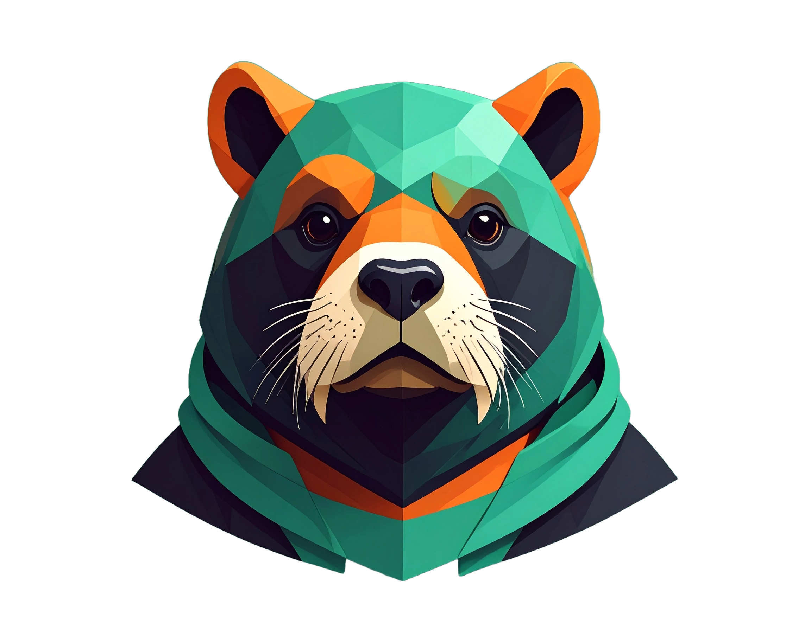

# 🚀 ROXY - The Ultimate Crypto Portfolio Manager

<div align="center">
  
  
  <h1 style="font-size: 4rem; margin: 0; color: #16A349;">ROXY</h1>
  <h2 style="font-size: 2rem; margin: 0; color: #FF6B6B;">CRYPTO PORTFOLIO MANAGER</h2>
  
  <p style="font-size: 1.2rem; margin: 1rem 0; color: #9CA3AF;">
    The ultimate crypto trading game where strategy meets opportunity. Build your empire, compete with the best, and dominate the markets.
  </p>
  
  [](https://reactjs.org/)
  [](https://www.typescriptlang.org/)
  [](https://vitejs.dev/)
  [](https://tailwindcss.com/)
  [](https://www.framer.com/motion/)
  [](https://pixijs.com/)
</div>

---

## 📖 Table of Contents

-   [🎮 What is Roxy?](#-what-is-roxy)
-   [✨ Key Features](#-key-features)
-   [🏗️ Architecture & Tech Stack](#️-architecture--tech-stack)
-   [🎯 Game Mechanics](#-game-mechanics)
-   [📱 User Interface](#-user-interface)
-   [🚀 Getting Started](#-getting-started)
-   [📁 Project Structure](#-project-structure)
-   [🎨 Design System](#-design-system)
-   [🔧 Development](#-development)
-   [📊 Game Data & State Management](#-game-data--state-management)
-   [🎭 Character System](#-character-system)
-   [🏆 Achievement System](#-achievement-system)
-   [👥 Guild System](#-guild-system)
-   [📈 Trading System](#-trading-system)
-   [🏅 Leaderboard System](#-leaderboard-system)
-   [🎨 Visual Effects](#-visual-effects)
-   [📱 Responsive Design](#-responsive-design)
-   [🔮 Future Features](#-future-features)
-   [🤝 Contributing](#-contributing)
-   [📄 License](#-license)

---

## 🎮 What is Roxy?

**Roxy** is a revolutionary crypto portfolio management game that combines the excitement of cryptocurrency trading with engaging gamification elements. Players step into the shoes of legendary traders, build their crypto empires, and compete in a dynamic, real-time trading environment.

### 🎯 Core Concept

Roxy transforms traditional portfolio management into an immersive gaming experience where:

-   **Strategy meets opportunity** in real-time crypto markets
-   **Competition drives excellence** through global leaderboards
-   **Community builds strength** via the guild system
-   **Achievement unlocks potential** through badges and XP progression

---

## ✨ Key Features

### 🏆 **Real-Time Trading**

-   Live crypto market data integration
-   Instant buy/sell execution
-   Real-time portfolio value updates
-   Advanced order types and market analysis

### 🎮 **Gamification Elements**

-   **XP System**: Earn experience points through trading activities
-   **Level Progression**: Unlock new features and capabilities
-   **Badge System**: Collect achievements for various milestones
-   **Character Avatars**: Choose from different trader personalities

### 🏅 **Competitive Features**

-   **Global Leaderboards**: Compete with traders worldwide
-   **Guild Leaderboards**: Team-based competition
-   **Weekly Resets**: Fresh competition cycles
-   **Rank Tracking**: Monitor your position changes

### 👥 **Social Features**

-   **Guild System**: Join forces with other traders
-   **Guild Chat**: Communicate with your trading team
-   **Guild Map**: Interactive guild territory visualization
-   **Team Strategies**: Collaborative trading approaches

### 📊 **Portfolio Management**

-   **Advanced Analytics**: Detailed performance metrics
-   **Portfolio Visualization**: Interactive charts and graphs
-   **Risk Assessment**: Real-time risk analysis
-   **Diversification Tools**: Smart portfolio optimization

---

## 🏗️ Architecture & Tech Stack

### **Frontend Framework**

-   **React 19.1.1** - Latest React with concurrent features
-   **TypeScript 5.9.3** - Type-safe development
-   **Vite 7.1.7** - Lightning-fast build tool

### **Styling & UI**

-   **Tailwind CSS 4.1.16** - Utility-first CSS framework
-   **Framer Motion 12.23.24** - Advanced animations
-   **React Icons 5.5.0** - Comprehensive icon library
-   **Recharts 3.3.0** - Data visualization

### **Graphics & Effects**

-   **PIXI.js 8.14.0** - 2D WebGL rendering
-   **@pixi/react 8.0.3** - React integration for PIXI
-   **@pixi/filter-drop-shadow 5.2.0** - Visual effects
-   **@pixi/filter-glow 5.2.1** - Glow effects

### **State Management**

-   **Zustand 5.0.8** - Lightweight state management
-   **React Router DOM 7.9.4** - Client-side routing

### **Development Tools**

-   **ESLint 9.36.0** - Code linting
-   **TypeScript ESLint 8.45.0** - TypeScript-specific linting
-   **PostCSS 8.5.6** - CSS processing
-   **Autoprefixer 10.4.21** - CSS vendor prefixes

---

## 🎯 Game Mechanics

### **Player Progression System**

#### **Experience Points (XP)**

-   Earn XP through successful trades
-   XP requirements increase with each level
-   1000 XP per level progression
-   Visual progress bar with smooth animations

#### **Level System**

-   Start at Level 1 with basic features
-   Unlock advanced tools at higher levels
-   Level-based trading limits and capabilities
-   Prestige system for veteran players

#### **Badge System**

-   **Trading Badges**: First trade, profit milestones, volume achievements
-   **Social Badges**: Guild activities, leaderboard positions
-   **Special Badges**: Rare achievements, seasonal events
-   **Badge Rarity**: Common, Rare, Epic, Legendary

### **Trading Mechanics**

#### **Asset Management**

-   **Real-time Pricing**: Live market data integration
-   **Portfolio Tracking**: Comprehensive holding management
-   **Profit/Loss Calculation**: Real-time P&L updates
-   **Risk Assessment**: Portfolio diversification metrics

#### **Trading Features**

-   **Instant Execution**: Real-time buy/sell orders
-   **Quantity Controls**: Precise amount selection
-   **Balance Management**: Available funds tracking
-   **Transaction History**: Complete trade log

---

## 📱 User Interface

### **Landing Page**

-   **Hero Section**: Compelling introduction with animated elements
-   **Feature Showcase**: Key platform capabilities
-   **Character Introduction**: Meet the trading personalities
-   **Call-to-Action**: Clear entry points to the game

### **Dashboard**

-   **Portfolio Overview**: Total value and performance metrics
-   **XP Progress**: Level progression visualization
-   **Recent Badges**: Latest achievements display
-   **Quick Stats**: Holdings count and best performers
-   **Navigation**: Easy access to all features

### **Markets Page**

-   **Asset Grid**: Visual crypto asset cards
-   **Live Ticker**: Scrolling price updates
-   **Sort Options**: Filter by gainers, losers, or all
-   **Trading Interface**: Integrated buy/sell modals
-   **Market Data**: 24h change, volume, market cap

### **Portfolio Page**

-   **Performance Charts**: 7-day portfolio growth visualization
-   **Holdings List**: Detailed asset breakdown
-   **P&L Analysis**: Individual asset performance
-   **Risk Metrics**: Portfolio diversification stats

### **Leaderboard Page**

-   **Global Rankings**: Worldwide trader competition
-   **Guild Rankings**: Team-based competition
-   **Reset Timer**: Weekly competition cycles
-   **Rank Changes**: Position movement tracking
-   **Player Stats**: Personal ranking information

### **Guilds Page**

-   **Guild Discovery**: Available guilds to join
-   **Current Guild**: Active guild information
-   **Guild Map**: Interactive territory visualization
-   **Guild Chat**: Team communication (coming soon)
-   **Guild Creation**: Start your own trading team

---

## 🚀 Getting Started

### **Prerequisites**

-   Node.js 18+
-   npm or yarn package manager
-   Modern web browser with WebGL support

### **Installation**

1. **Clone the repository**

    ```bash
    git clone https://github.com/your-username/pred-man-cli.git
    cd pred-man-cli
    ```

2. **Install dependencies**

    ```bash
    npm install
    # or
    yarn install
    ```

3. **Start development server**

    ```bash
    npm run dev
    # or
    yarn dev
    ```

4. **Open in browser**
    ```
    http://localhost:5173
    ```

### **Build for Production**

```bash
npm run build
# or
yarn build
```

### **Preview Production Build**

```bash
npm run preview
# or
yarn preview
```

---

## 📁 Project Structure

```
pred-man-cli/
├── 📁 public/                     # Static assets
│   └── vite.svg
├── 📁 src/                        # Source code
│   ├── 📁 assets/                 # Images and media
│   │   ├── roxy-logo.png         # Main logo
│   │   ├── roxy.png              # Main character
│   │   ├── roxy-33.png           # Character variant 1
│   │   ├── roxy-44.png           # Character variant 2
│   │   └── wealth.png            # Hero image
│   ├── 📁 components/             # Reusable components
│   │   ├── BuySellModal.tsx      # Trading interface
│   │   ├── CanvasBackground.tsx  # Animated background
│   │   └── Navbar.tsx            # Navigation component
│   ├── 📁 hooks/                  # Custom React hooks
│   ├── 📁 pages/                  # Page components
│   │   ├── Dashboard.tsx         # Main dashboard
│   │   ├── Guilds.tsx            # Guild management
│   │   ├── Landing.tsx           # Landing page
│   │   ├── Leaderboard.tsx       # Rankings
│   │   ├── Markets.tsx           # Trading interface
│   │   └── Portfolio.tsx         # Portfolio management
│   ├── 📁 store/                  # State management
│   │   └── gameStore.ts          # Zustand store
│   ├── 📁 utils/                  # Utility functions
│   │   └── cn.ts                 # Class name utilities
│   ├── App.tsx                    # Main app component
│   ├── App.css                    # Global styles
│   ├── index.css                  # Theme definitions
│   └── main.tsx                   # App entry point
├── 📁 dist/                       # Build output
├── 📄 components.json             # Component configuration
├── 📄 package.json                # Dependencies
├── 📄 README.md                   # This file
├── 📄 THEME_GUIDE.md              # Design system guide
├── 📄 tsconfig.json               # TypeScript config
└── 📄 vite.config.ts              # Vite configuration
```

---

## 🎨 Design System

### **Color Palette**

#### **Primary Colors**

-   **Primary Green**: `#16A349` - Main brand color
-   **Accent Red**: `#FF6B6B` - Secondary accent
-   **Background**: `#0A0A0A` - Dark theme base
-   **Text**: `#FFFFFF` - Primary text color

#### **Semantic Colors**

-   **Success**: `#16A349` - Positive actions/values
-   **Danger**: `#FF6B6B` - Negative actions/values
-   **Warning**: `#F59E0B` - Caution states
-   **Info**: `#3B82F6` - Informational content

### **Typography**

#### **Font Families**

-   **Brutal**: Main heading font (bold, impactful)
-   **Mono Brutal**: Code and data display
-   **System**: Body text and UI elements

#### **Font Sizes**

-   **Display**: 4rem+ (hero text)
-   **Heading 1**: 3rem (page titles)
-   **Heading 2**: 2rem (section titles)
-   **Heading 3**: 1.5rem (subsection titles)
-   **Body**: 1rem (regular text)
-   **Small**: 0.875rem (captions, labels)

### **Spacing Scale**

-   **xs**: 0.25rem (4px)
-   **sm**: 0.5rem (8px)
-   **md**: 1rem (16px)
-   **lg**: 1.5rem (24px)
-   **xl**: 2rem (32px)
-   **2xl**: 3rem (48px)
-   **3xl**: 4rem (64px)

### **Border Radius**

-   **sm**: 0.25rem (4px)
-   **md**: 0.5rem (8px)
-   **lg**: 0.75rem (12px)
-   **xl**: 1rem (16px)
-   **2xl**: 1.5rem (24px)
-   **full**: 9999px (circular)

### **Shadows & Effects**

-   **Standard Shadows**: sm, md, lg, xl, 2xl
-   **Primary Glow**: `0 0 20px rgb(22 163 73 / 0.3)`
-   **Large Glow**: `0 0 40px rgb(22 163 73 / 0.4)`
-   **Glass Morphism**: Backdrop blur effects

---

## 🔧 Development

### **Code Quality**

#### **Linting**

```bash
npm run lint
```

#### **Type Checking**

```bash
npx tsc --noEmit
```

### **Development Workflow**

1. **Feature Development**

    - Create feature branch from `main`
    - Implement changes with TypeScript
    - Add proper type definitions
    - Include responsive design considerations

2. **Testing**

    - Test all user interactions
    - Verify responsive behavior
    - Check animation performance
    - Validate state management

3. **Code Review**
    - Ensure code follows project conventions
    - Verify TypeScript types are correct
    - Check for accessibility compliance
    - Review performance implications

### **Performance Optimization**

#### **Bundle Analysis**

```bash
npm run build -- --analyze
```

#### **Key Optimizations**

-   **Code Splitting**: Route-based lazy loading
-   **Image Optimization**: WebP format with fallbacks
-   **Tree Shaking**: Unused code elimination
-   **Memoization**: React.memo for expensive components

---

## 📊 Game Data & State Management

### **Zustand Store Architecture**

The game uses Zustand for lightweight, performant state management with the following structure:

#### **Player State**

```typescript
interface Player {
    name: string; // Player display name
    balance: number; // Available trading funds
    xp: number; // Experience points
    level: number; // Current level
    badges: Badge[]; // Earned achievements
    avatar: string; // Selected character
}
```

#### **Portfolio State**

```typescript
interface Holding {
    symbol: string; // Asset symbol (BTC, ETH, etc.)
    name: string; // Full asset name
    quantity: number; // Amount held
    buyPrice: number; // Purchase price
    currentPrice: number; // Current market price
    logo: string; // Display symbol/emoji
}
```

#### **Market Data**

```typescript
interface Asset {
    symbol: string; // Trading symbol
    name: string; // Full name
    price: number; // Current price
    change24h: number; // 24h percentage change
    logo: string; // Visual representation
    marketCap: number; // Market capitalization
}
```

### **State Actions**

#### **Trading Actions**

-   `buyAsset(symbol, amount)` - Purchase crypto assets
-   `sellAsset(symbol, amount)` - Sell crypto assets
-   `updatePortfolioValues()` - Recalculate portfolio metrics

#### **Player Actions**

-   `addXP(points)` - Award experience points
-   `addBadge(badge)` - Grant achievement badges

#### **Guild Actions**

-   `joinGuild(guildId)` - Join a trading guild
-   `leaveGuild()` - Leave current guild

---

## 🎭 Character System

### **Available Characters**

#### **Roxy (Main Character)**

-   **Personality**: Legendary trader with unmatched charisma
-   **Specialty**: Balanced trading approach
-   **Avatar**: Shield icon with rotating animation
-   **Unlock**: Default character

#### **Roxy 33**

-   **Personality**: Strategic mastermind with lightning-fast reflexes
-   **Specialty**: High-frequency trading
-   **Avatar**: Lightning bolt with dynamic animation
-   **Unlock**: Level 5

#### **Roxy 44**

-   **Personality**: Precision trader with unmatched accuracy
-   **Specialty**: Long-term investment strategies
-   **Avatar**: Target icon with scaling animation
-   **Unlock**: Level 10

### **Character Progression**

-   Each character has unique trading bonuses
-   Unlock new characters through level progression
-   Character-specific achievements and badges
-   Visual customization options

---

## 🏆 Achievement System

### **Badge Categories**

#### **Trading Badges**

-   **First Trade**: Complete your first transaction
-   **Profit Master**: Achieve 100% portfolio growth
-   **Volume King**: Trade $1M+ in total volume
-   **Diamond Hands**: Hold an asset for 30+ days
-   **Day Trader**: Complete 100 trades in a day

#### **Social Badges**

-   **Guild Leader**: Create and lead a successful guild
-   **Team Player**: Contribute to guild success
-   **Top Performer**: Rank in top 10 globally
-   **Community Helper**: Help other players

#### **Special Badges**

-   **Lucky Streak**: Win 10 trades in a row
-   **Market Master**: Predict 5 major market movements
-   **Risk Taker**: Make high-risk, high-reward trades
-   **Conservative**: Maintain positive P&L for 30 days

### **Badge Rarity System**

-   **Common** (Green): Basic achievements
-   **Rare** (Blue): Intermediate milestones
-   **Epic** (Purple): Advanced accomplishments
-   **Legendary** (Gold): Exceptional achievements

---

## 👥 Guild System

### **Guild Features**

#### **Guild Discovery**

-   Browse available guilds
-   View member counts and total values
-   Read guild descriptions and specialties
-   Join guilds that match your trading style

#### **Guild Management**

-   Create your own guild
-   Set guild name and description
-   Invite other players
-   Manage guild settings

#### **Guild Competition**

-   Guild-specific leaderboards
-   Team-based achievements
-   Collaborative trading strategies
-   Guild vs. guild competitions

#### **Guild Communication**

-   Real-time chat system (coming soon)
-   Trading strategy discussions
-   Market analysis sharing
-   Social interaction features

### **Guild Benefits**

-   **Shared Knowledge**: Learn from experienced traders
-   **Team Bonuses**: Guild-specific trading advantages
-   **Social Features**: Connect with like-minded traders
-   **Competitive Edge**: Team-based leaderboard rankings

---

## 📈 Trading System

### **Trading Interface**

#### **Buy/Sell Modal**

-   **Asset Selection**: Choose from available cryptocurrencies
-   **Quantity Input**: Specify exact amounts to trade
-   **Price Display**: Real-time market pricing
-   **Balance Check**: Verify sufficient funds
-   **Confirmation**: Review before executing

#### **Market Data**

-   **Live Prices**: Real-time cryptocurrency values
-   **24h Changes**: Percentage and absolute changes
-   **Market Cap**: Total market capitalization
-   **Volume**: Trading volume metrics

#### **Portfolio Tracking**

-   **Real-time Updates**: Instant value recalculation
-   **P&L Analysis**: Profit and loss tracking
-   **Performance Metrics**: ROI and growth rates
-   **Risk Assessment**: Portfolio diversification

### **Trading Mechanics**

#### **Order Execution**

-   **Instant Settlement**: Immediate trade completion
-   **Price Validation**: Real-time price verification
-   **Balance Updates**: Automatic fund management
-   **Transaction Logging**: Complete trade history

#### **Portfolio Management**

-   **Holding Tracking**: Monitor all positions
-   **Average Cost**: Calculate weighted buy prices
-   **Current Value**: Real-time position valuation
-   **Performance Analysis**: Individual asset tracking

---

## 🏅 Leaderboard System

### **Competition Types**

#### **Global Leaderboard**

-   **Worldwide Rankings**: Compete with all players
-   **Portfolio Value**: Total portfolio worth
-   **Profit Percentage**: Performance-based ranking
-   **Rank Changes**: Track position movements

#### **Guild Leaderboard**

-   **Team Rankings**: Guild-specific competition
-   **Collaborative Scoring**: Team performance metrics
-   **Guild vs. Guild**: Inter-guild competitions
-   **Member Contributions**: Individual guild rankings

### **Ranking System**

#### **Scoring Metrics**

-   **Portfolio Value**: Total asset worth
-   **Profit Percentage**: Performance ratio
-   **Trading Volume**: Activity level
-   **Consistency**: Stable performance over time

#### **Ranking Updates**

-   **Real-time**: Live position updates
-   **Weekly Reset**: Fresh competition cycles
-   **Historical Tracking**: Long-term performance
-   **Achievement Recognition**: Milestone celebrations

### **Competition Features**

-   **Reset Timer**: Countdown to next competition
-   **Rank Icons**: Visual ranking indicators
-   **Change Tracking**: Position movement arrows
-   **Personal Stats**: Individual performance metrics

---

## 🎨 Visual Effects

### **Animation System**

#### **Framer Motion Integration**

-   **Page Transitions**: Smooth route changes
-   **Component Animations**: Staggered element reveals
-   **Hover Effects**: Interactive feedback
-   **Loading States**: Engaging loading animations

#### **Custom Animations**

-   **Floating Elements**: Subtle background animations
-   **Progress Bars**: Smooth XP and level progression
-   **Chart Animations**: Data visualization transitions
-   **Modal Transitions**: Smooth overlay animations

### **PIXI.js Graphics**

#### **Canvas Background**

-   **Particle Systems**: Dynamic background effects
-   **Geometric Shapes**: Animated visual elements
-   **Color Transitions**: Smooth color changes
-   **Performance Optimization**: Efficient rendering

#### **Visual Effects**

-   **Drop Shadows**: Depth and dimension
-   **Glow Effects**: Highlighting important elements
-   **Particle Trails**: Interactive visual feedback
-   **Dynamic Lighting**: Atmospheric effects

### **Responsive Animations**

-   **Mobile Optimized**: Touch-friendly interactions
-   **Performance Scaling**: Adaptive quality settings
-   **Battery Conscious**: Efficient animation loops
-   **Accessibility**: Reduced motion support

---

## 📱 Responsive Design

### **Breakpoint System**

#### **Mobile First Approach**

-   **Base Styles**: Mobile-optimized design
-   **Progressive Enhancement**: Desktop improvements
-   **Touch Interactions**: Mobile-friendly controls
-   **Performance Focus**: Optimized for mobile devices

#### **Responsive Breakpoints**

-   **Mobile**: 320px - 768px
-   **Tablet**: 768px - 1024px
-   **Desktop**: 1024px - 1440px
-   **Large Desktop**: 1440px+

### **Layout Adaptations**

#### **Navigation**

-   **Mobile**: Collapsible sidebar
-   **Desktop**: Fixed sidebar navigation
-   **Touch**: Swipe gestures for navigation
-   **Keyboard**: Full keyboard navigation support

#### **Content Layout**

-   **Grid Systems**: Responsive card layouts
-   **Typography**: Scalable text sizing
-   **Spacing**: Adaptive padding and margins
-   **Images**: Responsive image sizing

### **Performance Considerations**

-   **Lazy Loading**: On-demand content loading
-   **Image Optimization**: WebP with fallbacks
-   **Code Splitting**: Route-based loading
-   **Caching**: Efficient resource caching

---

## 🔮 Future Features

### **Planned Enhancements**

#### **Advanced Trading**

-   **Order Types**: Limit orders, stop losses
-   **Trading Pairs**: More cryptocurrency options
-   **Advanced Charts**: Technical analysis tools
-   **Trading Bots**: Automated trading strategies

#### **Social Features**

-   **Real-time Chat**: Guild and global chat
-   **Social Trading**: Copy successful traders
-   **Mentorship**: Experienced trader guidance
-   **Events**: Community trading events

#### **Gamification**

-   **Quests**: Daily and weekly challenges
-   **Tournaments**: Competitive trading events
-   **NFT Integration**: Unique character assets
-   **Achievement Rewards**: Unlockable content

#### **Analytics**

-   **Advanced Metrics**: Detailed performance analysis
-   **Risk Management**: Portfolio risk assessment
-   **Market Insights**: AI-powered market analysis
-   **Trading Journal**: Detailed trade logging

### **Technical Improvements**

-   **Real-time Data**: WebSocket integration
-   **Offline Support**: Progressive Web App features
-   **Mobile App**: Native mobile applications
-   **API Integration**: External data sources

---

## 🤝 Contributing

We welcome contributions to Roxy! Here's how you can help:

### **Ways to Contribute**

#### **Code Contributions**

-   **Bug Fixes**: Report and fix issues
-   **Feature Development**: Implement new features
-   **Performance**: Optimize existing code
-   **Documentation**: Improve project documentation

#### **Design Contributions**

-   **UI/UX**: Improve user interface design
-   **Animations**: Create engaging animations
-   **Graphics**: Design visual elements
-   **Accessibility**: Improve accessibility features

#### **Community Contributions**

-   **Testing**: Test new features and report bugs
-   **Feedback**: Provide user experience feedback
-   **Documentation**: Write guides and tutorials
-   **Translation**: Help with internationalization

### **Development Guidelines**

#### **Code Standards**

-   **TypeScript**: Use strict type checking
-   **ESLint**: Follow project linting rules
-   **Prettier**: Maintain consistent code formatting
-   **Testing**: Include tests for new features

#### **Commit Convention**

```
type(scope): description

feat(trading): add limit order functionality
fix(ui): resolve modal positioning issue
docs(readme): update installation instructions
```

#### **Pull Request Process**

1. Fork the repository
2. Create a feature branch
3. Make your changes
4. Add tests if applicable
5. Submit a pull request
6. Address review feedback

---

## 📄 License

This project is licensed under the MIT License - see the [LICENSE](LICENSE) file for details.

### **MIT License Summary**

-   ✅ Commercial use allowed
-   ✅ Modification allowed
-   ✅ Distribution allowed
-   ✅ Private use allowed
-   ❌ No liability or warranty provided

---

## 🙏 Acknowledgments

### **Open Source Libraries**

-   **React** - UI framework
-   **TypeScript** - Type safety
-   **Vite** - Build tooling
-   **Tailwind CSS** - Styling
-   **Framer Motion** - Animations
-   **PIXI.js** - Graphics rendering
-   **Zustand** - State management
-   **Recharts** - Data visualization

### **Design Inspiration**

-   **Brutalist Design** - Bold, impactful aesthetics
-   **Gaming UI** - Engaging user interfaces
-   **Financial Apps** - Professional trading interfaces
-   **Modern Web Design** - Contemporary design patterns

### **Community**

-   **Contributors** - All code contributors
-   **Testers** - Beta testing community
-   **Feedback** - User suggestions and improvements
-   **Support** - Community support and help

---

<div align="center">
  <h3>🚀 Ready to Start Your Trading Journey?</h3>
  <p>Join thousands of traders already building their crypto empires with Roxy!</p>
  
  <a href="https://github.com/your-username/pred-man-cli" style="display: inline-block; background: #16A349; color: white; padding: 12px 24px; text-decoration: none; border-radius: 8px; font-weight: bold; margin: 8px;">
    🎮 Start Trading Now
  </a>
  
  <a href="https://github.com/your-username/pred-man-cli/issues" style="display: inline-block; background: #FF6B6B; color: white; padding: 12px 24px; text-decoration: none; border-radius: 8px; font-weight: bold; margin: 8px;">
    🐛 Report Issues
  </a>
  
  <a href="https://github.com/your-username/pred-man-cli/discussions" style="display: inline-block; background: #3B82F6; color: white; padding: 12px 24px; text-decoration: none; border-radius: 8px; font-weight: bold; margin: 8px;">
    💬 Join Discussion
  </a>
  
  <br><br>
  
  <p style="color: #9CA3AF; font-size: 0.9rem;">
    Made with ❤️ by the Roxy Team | Built with React, TypeScript, and lots of ☕
  </p>
</div>

---

_Last updated: December 2024_
